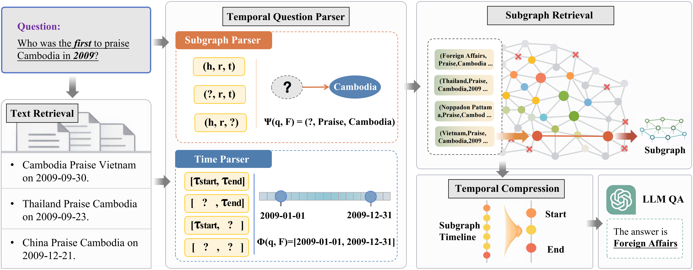

# 💎 SSR

<p align="center">
  
</p>

This is the official implementation of  
**[SIGIR 2026] SSR: Structured Subgraph Retrieval for Temporal Knowledge Graph Question Answering with LLMs**


## 📊 Datasets

The SSR framework uses the MultiTQ and TimelineKGQA datasets for evaluation. Below are instructions to download these datasets:

### 📦 MultiTQ Dataset

Visit the https://github.com/czy1999/MultiTQ.

```bash
git clone https://github.com/czy1999/MultiTQ.git
cd MultiTQ/data
unzip Dataset.zip
```

Alternatively, download the dataset directly from Hugging Face:  
Datasets Link: https://huggingface.co/datasets/chenziyang/MultiTQ

### 📦 TimelineKGQA Dataset

Visit the https://github.com/PascalSun/TimelineKGQA/tree/main/Datasets

```bash
git clone https://github.com/PascalSun/TimelineKGQA.git
cd Datasets
```

**Note:** The TimelineKGQA dataset is generated based on ICEWS Actor and CronQuestions KG. We only use the CronQuestions KG part.


## 🧪 Evaluation

### 1. Set environment variables

```bash
export OPENAI_API_KEY="your_key"
export OPENAI_MODEL_NAME="gpt-4o-mini"
```

### 2. Run SSR on MultiTQ

```bash
python run_pipeline.py \
  --run-text-retrieval \
  --run-graph-retrieval \
  --run-graph-qa \
  --kg-path ./datasets/MultiTQ/kg/full.txt \
  --qa-path ./datasets/MultiTQ/questions/test.json \
  --entity-path ./datasets/MultiTQ/kg/entity2id.json \
  --relation-path ./datasets/MultiTQ/kg/relation2id.json \
  --graph-pattern-prompt ./prompts/gp_prompt.txt \
  --qa-prompt ./prompts/qa_prompt.txt \
  --text-retriever-model-name /path/to/bge-m3
```

<!--
## 📌 Citation

```bibtex
% todo
```
-->
